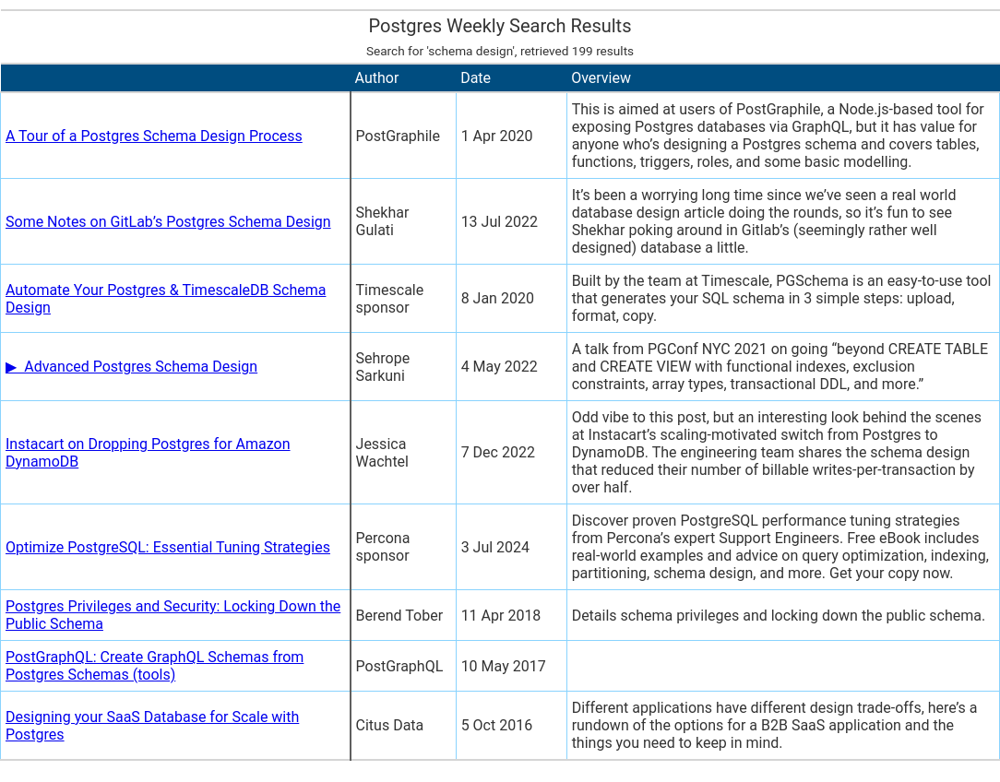

# Postgres Weekly Newsletter Search Tool

## Overview

This repository contains scripts for loading content from the Postgres Weekly
newsletter, parsing it and upserting the content into a DuckDB database. Once
the content is stored in DuckDB, users can perform full-text search to quickly
and efficiently find relevant information. It scratches an itch I had which is
that the [Postgres Weekly](https://postgresweekly.com/) site does not provide
search and often I want to find stuff I've read in the past from the newsletter
but vaguely remember.

## Key Features

- **DuckDB Backend**: DuckDB is embedded/in-process hence no need to set up a
  server
- **Incremental Loading**: once previous issues/newsletters have been loaded,
  future issues can be inserted incrementally rather than carrying out a full
  ETL for the entire site every week an issue is published. Loading can be
  scheduled via a CRON job
- **Full-Text Search:** DuckDB's
  [Full Text Search Extension](https://duckdb.org/2021/01/25/full-text-search.html)
  offers decent search with relevant results right out of the box

## Getting Started

### Prerequisites

Before you begin, ensure you have met the following requirements:

- Python 3.10+
- DuckDB
- Plus any other dependencies listed in `requirements.txt`

### Installation

1. Clone the repository:

   ```bash
   git clone git@github.com:bnm3k/pg_weekly_search.git
   ```
2. Navigate to the repository directory:

   ```bash
   cd pg_weekly_search
   ```

3. Install the required packages:

   ```bash
   pip install -r requirements.txt
   ```

### Usage: Loading Content

To setup the DB (i.e. an empty DB with the schema created), run the `init_db.py`
script:

```bash
python init_db.py
```

By default, it creates a db with the name `pg_weekly.db` at the project root
based on the schema `schema.sql`. To configure the name or path where the db
will be created, use the `--db` CLI option. If the schema is stored somewhere
else, use `--schema` CLI option to specify its path.

To load the data, run the `load.py` script:

```bash
python load.py
```

This script retrieves raw html from the PG Weekly site and stores the content at
the `data/` directory (to use a different location, pass the path via the
`--data_dir` CLI option). Once all the raw html has been retrieved,
[Beautiful Soup](https://pypi.org/project/beautifulsoup4/) is used to parse the
HTML and extract structured content. After parsing, the data is inserted into
the DuckDB database (defaults to `pg_weekly.db` at the project root but can be
configured to elsewhere via the `--db` CLI option).

### Usage: Searching through the Content

To search through the content, use the `search.py` script:

```bash
python search.py [search_terms ...]
```

For example, to search for entries that include the terms "schema design":

```bash
python search.py "schema design"
```

This launches the browser which displays:



If you want to output to terminal instead, pass the `--cli` flag:

```bash
python search.py --cli "paxos"
```

This outputs

```
shape: (2, 4)
┌─────────────────────────┬────────────┬────────────┬────────────────────────────────┐
│ title                   ┆ author     ┆ date       ┆ content                        │
│ ---                     ┆ ---        ┆ ---        ┆ ---                            │
│ str                     ┆ str        ┆ str        ┆ str                            │
╞═════════════════════════╪════════════╪════════════╪════════════════════════════════╡
│ pg_paxos: High          ┆ Citus Data ┆ 2015-11-25 ┆                                │
│ Availability Da…        ┆            ┆            ┆ The pg_paxos extension demons… │
│ Master-less Distributed ┆ Citus Data ┆ 2016-04-27 ┆ Pg_paxos is a database-level   │
│ Queue …                 ┆            ┆            ┆ i…                             │
└─────────────────────────┴────────────┴────────────┴────────────────────────────────┘
```

If elsewhere, or you are running this script from a different directory, you can
specify the DB path via the `--db` CLI option.

## Vector Similarity Search

To create embeddings and set up the index for vector search, use the
`gen_embeddings.py` script:

```bash
python gen_embeddings.py
```

## Contributing

Contributions are welcome! Please fork the repository and create a pull request
with your changes.

1. Fork the Project
2. Create your Feature Branch (git checkout -b feature/AmazingFeature)
3. Commit your Changes (git commit -m 'Add some AmazingFeature')
4. Push to the Branch (git push origin feature/AmazingFeature)
5. Open a Pull Request

## License

Distributed under the MIT License. See LICENSE for more information.

## TODO / Future Additions

- **Interactive Web Interface**: Develop a web-based UI to make the tool more
  interactive and user-friendly.
- **Vector Search**: Implement vector search (mostly for comparison with
  Full-text search)
